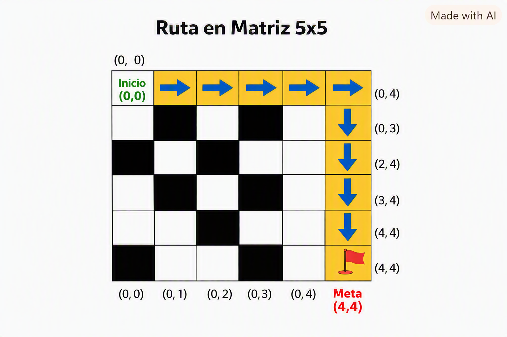
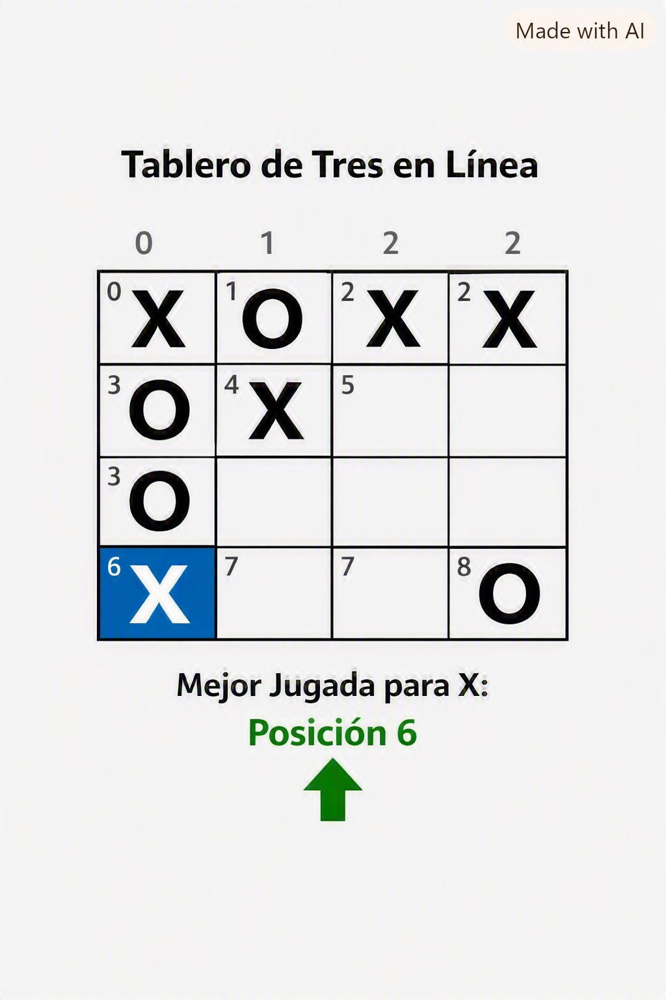

# Semana 04 – Marco Tecnológico de la IA

##  Explicación
Esta semana trabajé con **algoritmos de búsqueda** y **juegos adversariales**, 

##  Lo que hice
- Implementé el algoritmo **A\*** para encontrar rutas óptimas en una cuadrícula.
- Implementé el algoritmo **Minimax** para decidir jugadas en el juego de tres en línea.
- Probé ambos algoritmos con ejemplos simples y analicé sus resultados.

## Explicación del código

### 🔹 A*
- **Estado:** posición en la cuadrícula  
- **Acción:** movimiento hacia arriba, abajo, izquierda o derecha  
- **Meta:** llegar al objetivo  
- **Costo:** número de pasos  
- **Heurística:** distancia Manhattan  

### 🔹 Minimax
- **Estado:** tablero de juego  
- **Acción:** jugada posible  
- **Función de utilidad:** ganar (+1), perder (−1), empatar (0)  
- **Árbol de decisiones:** posibles jugadas futuras  
- **Poda alfa‑beta:** optimización para reducir cálculos innecesarios  

##  Resultados

### 🔹 A*
El algoritmo encontró una ruta válida y calculó su costo.

**Salida del programa:**
Ruta: [(0, 0), (0, 1), (0, 2), (0, 3), (0, 4), (1, 4), (2, 4), (3, 4), (4, 4)]
Costo: 8

**Visualización de la ruta:**

**Interpretación:**
Cada par `(fila, columna)` representa una celda de la matriz.  
El algoritmo avanzó primero hacia la derecha y luego hacia abajo, evitando los obstáculos.

### 🔹 Minimax
El algoritmo devolvió la mejor jugada para **X** en el tablero dado.

**Salida del programa:**
Tablero: ['X', 'O', 'X', 'O', 'X', ' ', ' ', ' ', 'O']
Mejor posición para X: 6

**Visualización del tablero:**

**Interpretación:**
El tablero se representa como una matriz 3×3.  
La mejor jugada para **X** está en la **posición 6**, que corresponde a la esquina inferior izquierda.

## Conclusiones
- **A\*** demuestra cómo una heurística guía la búsqueda hacia la meta más eficiente.  
- **Minimax** evidencia cómo anticipar decisiones de un oponente en juegos competitivos.  
- Ambos algoritmos son base para sistemas más complejos de IA, como planificación, robótica y videojuegos.

