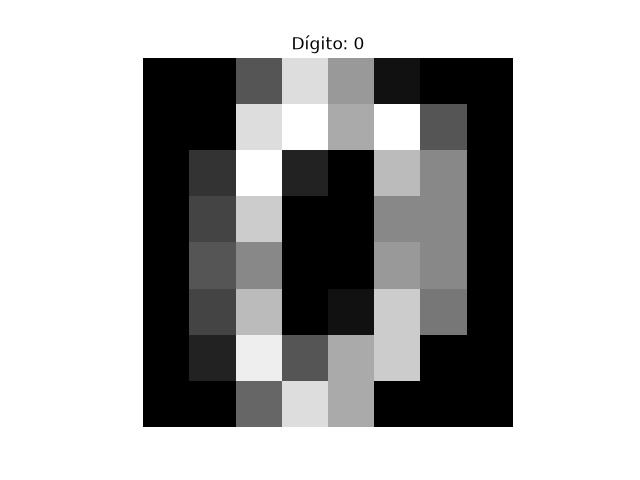
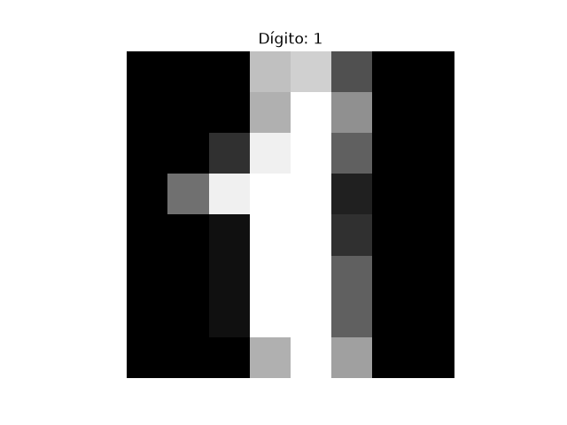
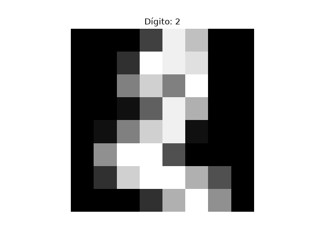
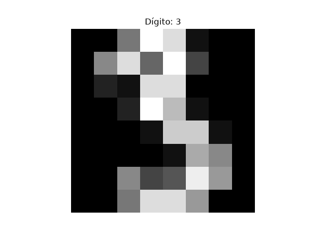
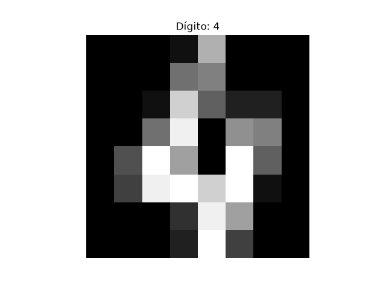

# Semana 08 - Reconocimiento con red neuronal, base de datos y ontología

## Explicación
En esta semana se integran tres piezas fundamentales:
- **Red neuronal MLP**: reconoce patrones en imágenes de dígitos manuscritos.
- **Base de datos SQLite**: registra evidencia mínima de las imágenes y etiquetas.
- **Ontología GraphML**: expresa el significado de las predicciones dentro del dominio.

El objetivo es demostrar que el reconocimiento no es solo predecir, sino también **registrar evidencia y explicar significado**.

---

## Lo que hice
- Creé el archivo `src/semana08_red_ontologia.py`.
- Entrené una red neuronal MLP para clasificar dígitos 0–9.
- Guardé el modelo entrenado en `artifacts/modelo_mlp.pkl`.
- Registré metadatos de imágenes en `artifacts/imagenes.db`.
- Construí una ontología en `artifacts/ontologia.graphml`.
- Generé imágenes de ejemplo en `artifacts/digito_0.png` a `digito_4.png`.
- Documenté resultados y conclusiones en este reporte.

---

## Explicación del código
- **Bloque 1 (imports y dataset):** carga librerías y divide datos en entrenamiento y prueba.
- **Bloque 2 (MLP):** entrena la red neuronal y calcula precisión.
- **Bloque 3 (SQLite):** registra evidencia de imágenes sin borrar registros previos.
- **Bloque 4 (Ontología):** define relaciones con significado y exporta a GraphML.
- **Bloque 5 (Integración):** conecta una predicción real con la ontología.
- **Bloque 6 (Imágenes):** genera y guarda ejemplos visuales de dígitos 8×8.

---

## Resultados

### Precisión del modelo

---

### Base de datos
Tabla `images` con registros:
id | label | split
0  | 0     | dataset
1  | 1     | dataset

---

### Ontología
Relaciones exportadas: 7 básicas + relaciones dinámicas de predicción.

### Imágenes generadas

---

## Tabla comparativa

| **Componente** | **Función**                  | **Evidencia**                  | **Significado**                  |
|----------------|-------------------------------|--------------------------------|----------------------------------|
| **Modelo MLP** | Predice clase del dígito      | Accuracy y salida              | Reconocimiento de patrones       |
| **SQLite**     | Registra metadatos            | imagenes.db con registros      | Auditoría y trazabilidad         |
| **Ontología**  | Expresa relaciones            | ontologia.graphml exportado    | Interpretación dentro del dominio |

---

## Conclusiones
El sistema híbrido de la Semana 08 logra:
- Reconocer patrones con una red neuronal.
- Registrar evidencia persistente en una base de datos.
- Explicar el significado de las predicciones mediante una ontología.

La integración asegura que una predicción no quede aislada: se conecta con la **imagen original**, se respalda con **evidencia** y se interpreta en el **dominio**.  
Esto fortalece la trazabilidad y la sustentabilidad del proyecto final.
